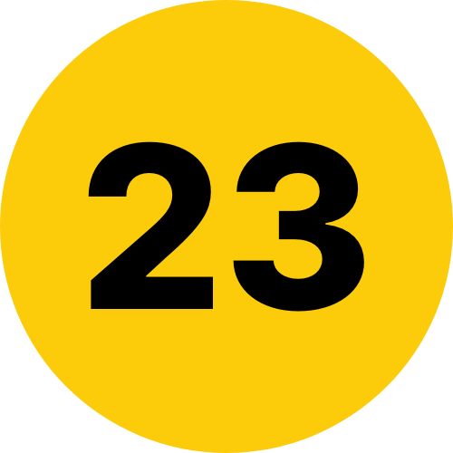

# Route23

[](https://www.codacy.com/gh/Route23/Route23/dashboard?utm_source=github.com&amp;utm_medium=referral&amp;utm_content=Route23/Route23&amp;utm_campaign=Badge_Grade)



deploy site : https://route23.pages.dev/ <br>
deploy service : Cloudflare pages

## Commands

```
npm install
npm start
npm run build
```

## Junction

| `601`                                                                 | Web      |
|-----------------------------------------------------------------------|:---------|
|  `INACTIVE` | Frontend |

| `602`                                                       | Research            |
|-------------------------------------------------------------|:--------------------|
|  `INACTIVE` | Wayfinding Research |
|  `INACTIVE` | Music Research      |

| `603`                                                       | OSS      |
|-------------------------------------------------------------|:---------|
|  `ACTIVE` | SubwayUI |
|  `ACTIVE` | gh-ibli  |

## Donation
ETH Address
```
0x1dE4649cf7D9362311F2Ed3caeDAfebd4DB31A6E
```

